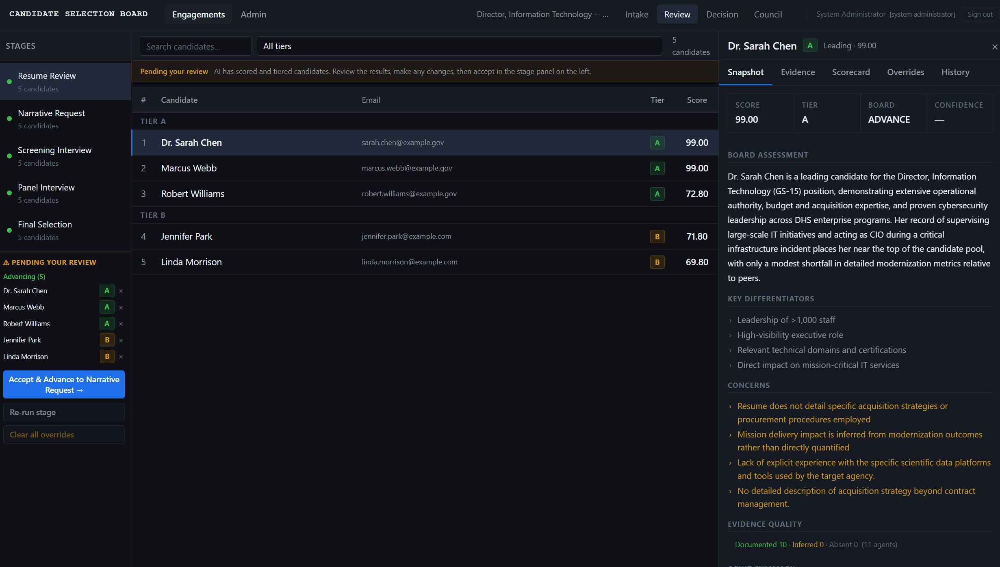
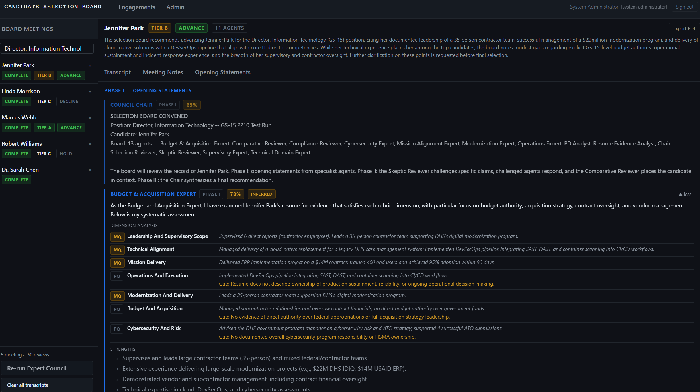

# Candidate Selection Board

Candidate Selection Board is a self-hosted platform for structured, AI-assisted hiring decisions. It runs a 13-agent expert council that simulates board deliberation - specialist agents evaluate each candidate independently, a skeptic agent challenges unsupported claims, domain experts rebut with evidence, and a board chair synthesizes a consensus recommendation. The result is a defensible, auditable hiring decision backed by a full deliberation transcript. For federal deployments, the platform ships with FISMA Moderate authentication, session controls, and a complete compliance documentation set.



## Core Capabilities

### Expert Council AI

The primary differentiator is a multi-agent deliberation engine modeled on how expert selection boards actually work.

**Thirteen named specialist agents** each hold a defined role:

| Agent | Role |
| --- | --- |
| PD Analyst | Interprets the position description and maps critical factors to evaluation dimensions |
| Resume Evidence Analyst | Extracts and validates documented evidence from the resume |
| Supervisory Expert | Evaluates leadership scope, span of control, and supervisory depth |
| Technical Domain Expert | Assesses technical skill alignment to position requirements |
| Mission Alignment Expert | Evaluates organizational fit and mission delivery orientation |
| Budget & Acquisition Expert | Reviews budget stewardship and acquisition experience |
| Cybersecurity Expert | Assesses security posture and risk management depth |
| Operations Expert | Evaluates operational execution and delivery track record |
| Modernization Expert | Assesses transformation, modernization, and technology adoption |
| Skeptic Reviewer | Challenges 2-3 specific claims from the opening round, naming the agent and the claim |
| Compliance Reviewer | Evaluates policy adherence, regulatory awareness, and governance |
| Comparative Reviewer | Contextualizes the candidate relative to the full applicant pool |
| Selection Reviewer (Chair) | Synthesizes all positions into a final recommendation with tier and confidence score |



**Three deliberation phases** run in sequence:

1. **Opening Statements** - Each specialist independently evaluates the candidate across all rubric dimensions, tags evidence quality (DOCUMENTED / INFERRED / ABSENT), and rates their own confidence from 0.0 to 1.0.
2. **Skeptic Challenges and Rebuttals** - The Skeptic Reviewer targets specific named claims from Phase I. Challenged agents respond with a disposition: SUSTAINED, OVERTURNED, or QUALIFIED. The Comparative Reviewer places the candidate in pool context.
3. **Chair Synthesis** - The Selection Reviewer reads the full transcript and delivers a recommendation (ADVANCE / HOLD / DECLINE), tier assignment (A / B / C), confidence score, and a list of open questions requiring human resolution.

Agents cross-reference each other's statements throughout. Partial transcripts are persisted in real time during deliberation. The complete board meeting record - all three phases, every agent turn, the full transcript - is stored and auditable. AI cannot unilaterally advance a candidate; all recommendations require human adjudication.

Each expert agent is independently configurable: provider, model, temperature, and token limit are set per-agent in the admin settings, supporting mixed-model councils.

### Five-Stage Review Chain

The platform executes a five-stage workflow: Resume Review -> Narrative Request -> Screening Interview -> Panel Interview -> Final Selection. Each stage is independently scored, adjudicated, and locked before candidates advance. AI generates stage-specific interview questions from the candidate's resume and narrative responses at each transition.

### Multi-Provider AI

Configurable at deployment: Ollama (local/air-gapped), OpenAI, Anthropic Claude, or Google Gemini. Each expert agent can use a different provider and model within the same council run.

### Position Analysis and Rubric Generation

The platform analyzes position descriptions to extract duties, identify critical factors, and generate weighted evaluation dimensions. Seven factor categories - Leadership, Technical Alignment, Mission Delivery, Operations, Modernization, Budget & Acquisition, and Cybersecurity - are weighted by role type. The rubric is editable before the review begins and locked once evaluations start.

### Audit and Compliance

Every authentication action, case modification, evaluation, adjudication decision, and export is written to an immutable audit log. Decision packages are exportable as a self-contained archive (case record, evaluations, board transcripts, and audit trail). For federal deployments, optional FISMA Moderate compliance documentation covers the full control set.

## Security Architecture

Candidate Selection Board implements FISMA Moderate authentication with Argon2id password hashing, TOTP MFA enforced for privileged roles, and OIDC SSO for agency identity providers (Login.gov, ADFS, Okta). PIV/CAC enforcement is delegated to the upstream identity provider.

Session controls enforce a 15-minute idle timeout (AC-11), 8-hour absolute timeout (AC-12), a maximum of three concurrent sessions (AC-10), and account lockout after five failed attempts (AC-7). Seven named roles enforce least-privilege access. Immutable audit events capture every authentication action, case modification, evaluation, and adjudication decision.

The project implements SBOM-ready container workflows and publishes FISMA compliance documentation in `docs/`.

## Licensing

Candidate Selection Board uses the Business Source License 1.1. Internal use by organizations for their own hiring reviews, evaluation, development, and testing is permitted without restriction. Offering the platform as a hosted service, managed service, or paid consulting delivery requires separate permission. See `LICENSE` and `COMMERCIAL.md`.

## Prebuilt Images

Candidate Selection Board also ships as public GHCR images for operators who do not want to build locally:

```bash
docker pull ghcr.io/drdeathlabs/candidate-selection-board-backend:latest
docker pull ghcr.io/drdeathlabs/candidate-selection-board-frontend:latest
docker pull ghcr.io/drdeathlabs/candidate-selection-board-ocr:latest
docker compose -f docker-compose.pull.yml up -d
```

The full pull-based install path, admin bootstrap command, and version pinning guidance are in [docs/INSTALLATION.md](docs/INSTALLATION.md).

## Quick Start

### 1. Clone

```bash
git clone https://github.com/DrDeathLabs/candidate-selection-board.git
cd candidate-selection-board
```

### 2. Configure

```bash
cp .env.example .env
```

Edit `.env` and replace every `change-me` and `replace-with-*` value. At minimum set:

- `POSTGRES_PASSWORD`
- `TOTP_ENCRYPTION_KEY` (32-byte Fernet key - `python -c "from cryptography.fernet import Fernet; print(Fernet.generate_key().decode())"`)

### 3. Start the stack

```bash
docker compose up -d --build
```

### 4. Bootstrap the first admin account

```bash
docker compose exec api python -m app.bootstrap seed-admin
```

The generated password is printed once to stdout. Store it securely. Rotate it immediately via **Admin -> Users** after first login.

### 5. Open the app

```
http://127.0.0.1:8610
```

Sign in with `admin` and the generated password. Complete TOTP MFA enrollment before accessing any features.

## Repository Layout

```text
docs/                  Installation, user guide, production, and FISMA compliance docs
infra/                 Reverse proxy configuration
sbom/                  CycloneDX software bill of materials (per-image + merged)
scripts/               Operational scripts (SBOM generation, etc.)
services/
  backend/             FastAPI API, Celery workers, Alembic migrations
  frontend/            React + TypeScript SPA
  ocr/                 OCR microservice
docker-compose.yml     Multi-container local stack
docker-compose.pull.yml Prebuilt-image stack for GHCR deployments
.env.example           Environment template
```

## Documentation

- [Installation](docs/INSTALLATION.md)
- [User Guide](docs/USER_GUIDE.md)
- [Production Readiness](docs/PRODUCTION.md)
- [Security Policy](SECURITY.md)
- [Contributing](CONTRIBUTING.md)
- [Commercial Use](COMMERCIAL.md)
- [Support](SUPPORT.md)

### FISMA Compliance

- [Compliance Overview](docs/COMPLIANCE.md)
